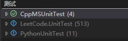

# LeetCode 刷题

适用 C++ Python C# 的LeetCode解题和单元测试解决方案架构

1. 使用 Visual Studio 测试资源管理器对所有题目进行单元测试
2. 使用 VSCode Testing 只适用C#, Python的单元测试

## 刷题题单

[LeetCode(Shawshank)的救赎](./LeetCode的救赎.md)

## 项目文件结构

- Cpp
  - CppSolution (C++ 题解)
  - CppMSUnitTest (C++ 单元测试，使用Microsoft Unit Testing框架)
- CSharp
  - CSharpSolution (C# 题解)
  - CSharpXUnitTest (C# 单元测试，使用XUnit)
- Python
  - PythonSolution (Python 题解)
  - PythonUnitTest (Python 单元测试，使用unittest)

## 文件命名定义

### C++

- 题目名称：`{id}_{problemName}.hpp`
- 单元测试名称：`{id}_{problemName}_test.cpp`

hpp 文件用于将类方法声明和定义写在一起
id 为题目编号，不包含前导填充0；problemName 为题目名称，CamelCase命名法

### C#

- 题目名称：`{id}_{ProblemName}.cs`
- 单元测试名称：`{id}_{ProblemName}_Test.cs`

id 为题目编号，不包含前导填充0；ProblemName 为题目名称，Pascal命名法

### Python

- 题目名称：`Q{id}_{problemName}.py`
- 单元测试名称：`test_Q1_{problemName}.py`

Python文件导入不能以数字开头，所以题目名称以 `Q` 开头，id 为题目编号，不包含前导填充0；problemName 为题目名称，CamelCase命名法

## 测试样例模板

### C++

在预编译头中添加 `#include <CppUnitTest.h>`，以使用 Microsoft Unit Testing 框架

```cpp
#include "pch.h" // 必须包含
#include "path_to_your_solution.hpp"

// 其他头文件

using namespace Microsoft::VisualStudio::CppUnitTestFramework;

namespace spaceName {
    TEST_CLASS(ClassName) {
    public:
        TEST_METHOD(MethodName) 
        {
            Solution solution;
            // 测试用例
            // ...
        }
    }
}
```

具体细节请参考[在 Visual Studio 中使用适用于 C++ 的 Microsoft Unit Testing 框架](https://learn.microsoft.com/zh-cn/visualstudio/test/how-to-use-microsoft-test-framework-for-cpp?view=visualstudio)

### C#

在Usings.cs中添加全局引用 `global using Xunit;`，以使用 XUnit 框架

```csharp
namespace LeetCode.UnitTest;

public class Solution{id}_ProblemName_Test
{
    [Theory]
    [InlineData(value1, value2, expectedValue)]
    public void ProblemName_InputSomething_ReturnSomething(type args1, type args2, type expected)
    {
        // Testcase
    }
}
```

### Python

`import unittest` 以使用 Python unittest 框架

```python
import unittest
from PythonSolution.xxx import Solution

class TestSolution(unittest.TestCase):
    # case1 ok
    def test_twoSum(self): 
        solution = Solution()
        # testcase

    # case2 ok
    def setUp(self) -> None:
        self.solution = Solution()
    
    def test_twoSum(self):
        # testcase
        pass
```

## 测试配置使用

### Visual Studio 测试资源管理器



#### C++

编写完题解和测试后，请在解决方案资源管理器中右键单击测试项目的节点并选择“生成”或“重新生成”，生成该测试项目。

#### C#

Visual Studio 亲儿子。

#### Python

在 PythonUnitTest 项目中添加 PythonSolution 项目的搜索路径。
保存后即自动扫描测试样例。

### VSCode Testing

#### C#

在VSCode中安装C#插件后，在测试文件中右键单击并选择“Run Test”即可。

#### Python

参考[Python testing in Visual Studio Code](https://code.visualstudio.com/docs/python/testing)